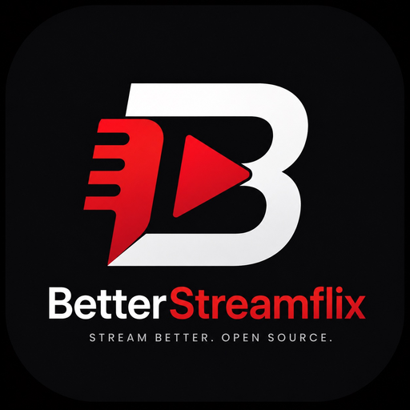

<h1 align="center">BetterStreamflix</h1>

<p align="center">
  
  <br />
  <a href="https://github.com/dskja/BetterStreamflix/stargazers"></a>
  <a href="https://github.com/dskja/BetterStreamflix/blob/main/LICENSE"></a>
  <a href="https://github.com/dskja/BetterStreamflix/releases/latest"></a>
  <a href="https://github.com/dskja/BetterStreamflix/releases"></a>
  
  <br />
  <a href="https://maidensail.com/startup/betterstreamflix" rel="dofollow"></a>
  <br />
  <strong>v1.1.1</strong> · Maintained by <a href="https://github.com/dskja">dskja</a>
  <br />
  An actively maintained fork of Streamflix with extra fixes, providers and UX improvements for Android TV and mobile.
  <br />
  <a href="https://github.com/dskja/BetterStreamflix/releases/latest">
    <strong>Download app »</strong>
  </a>
  <br />
  <br />
  <a href="https://t.me/BetterStreamflix">Telegram channel</a>
  ·
  <a href="https://discord.gg/R4F72rMUZ8">Discord</a>
  ·
  <a href="https://buymeacoffee.com/betterstreamflix">Buy me a coffee</a>
  ·
  <a href="https://www.patreon.com/BetterStreamflix">Patreon</a>
  ·
  <a href="https://github.com/sponsors/dskja">GitHub Sponsors</a>
  ·
  <a href="https://github.com/dskja/BetterStreamflix/issues">Report Bug</a>
  ·
  <a href="https://github.com/dskja/BetterStreamflix/issues">Request Feature</a>
</p>

> **One-time goal: $25** · Status: **open**  
> Personal basic costs during a tight stretch — so BetterStreamflix development can continue.  
> Not hosting, APIs, or servers. This ask closes when reached.  
> [Buy Me a Coffee](https://buymeacoffee.com/betterstreamflix) · [Patreon](https://www.patreon.com/BetterStreamflix) · [GitHub Sponsors](https://github.com/sponsors/dskja) · [Discord](https://discord.gg/R4F72rMUZ8)

<details>
  <summary>Table of Contents</summary>

- [About the project](#about-the-project)
  - [What is BetterStreamflix?](#what-is-betterstreamflix)
  - [Features](#features)
  - [Built with](#built-with)
- [Getting started](#getting-started)
  - [Prerequisites](#prerequisites)
  - [Setup](#setup)
- [Development](#development)
- [Contributing](#contributing)
- [Support](#support)
- [Legal Disclaimer](#legal-disclaimer)
- [Credits & Authors](#credits--authors)
- [License](#license)
</details>

## About the project

**BetterStreamflix** is maintained by **[dskja](https://github.com/dskja)**. It builds on the community Streamflix Reborn project and the original Streamflix app, with ongoing fixes and improvements.

### What is BetterStreamflix?

- **Active fork**: Continued fixes for providers, TV playback and settings
- **Same educational purpose**: Open-source Android TV / mobile streaming UI
- **Community channel**: Updates and discussion on [Telegram @BetterStreamflix](https://t.me/BetterStreamflix)

This app provides a user interface for accessing publicly available streaming content from various third-party providers. It is designed for educational purposes and personal use only. Users are responsible for ensuring they have proper authorization to access any content they view through this application.

### Features

- Open-source and ad-free interface
- Aggregates content from multiple third-party providers
- No account required for the app interface
- Educational and personal use only
- Optimized UI & UX for mobile and Android TV
- Multiple providers (incl. SerienStream via [serien.domains](https://serien.domains) proxy)
- Offline downloads with configurable storage location
- Chromecast queue + subtitles
- Optional Experimental UI (Lumina) and platform Integrations hub (Trakt VIP-gated, Jellyfin, Plex, …)
- Resume from last playback position
- In-app update from this repository’s releases

### Built with

- [Android Studio](https://developer.android.com/studio)
- [Kotlin](https://kotlinlang.org)
- [Retrofit](https://square.github.io/retrofit)
- [ExoPlayer / Media3](https://developer.android.com/media/media3)
- Leanback
- Coroutines
- MVVM Architecture
- Android Architecture Components

## Getting started

### Prerequisites

Install [Android Studio](https://developer.android.com/studio)

### Setup

1. Clone the project

```bash
git clone https://github.com/dskja/BetterStreamflix.git
```

2. Open the project in Android Studio

## Development

### Fast local loop (recommended)

Do **not** wait for CI release APKs while iterating. Use a local debug install — after the first build, small Kotlin/XML changes usually take seconds to a couple of minutes.

1. Open the project in Android Studio
2. Create `local.properties` (SDK path is auto-filled by Android Studio). Optional keys:
   - `APP_LAYOUT=mobile` or `APP_LAYOUT=tv` (omit for universal)
   - API keys as needed (`TMDB_API_KEY`, …)
3. Select an emulator or USB device
4. Click **Run** (debug) — or from the CLI:

```bash
./scripts/build-debug.sh              # universal debug APK
./scripts/build-debug.sh mobile       # mobile-only
./scripts/build-debug.sh tv install   # TV-only + adb install -r
./gradlew :app:installDebug           # Android Studio equivalent
```

Debug APK output: `app/build/outputs/apk/debug/`.  
Debug builds skip R8 minify/shrink and use application id `com.dskja.betterstreamflix.debug`.

### When to use CI APKs

| Workflow | When it runs | What you get | Typical wait |
| --- | --- | --- | --- |
| **Build APKs** | every push / PR (code changes) | 3 debug APKs (universal / mobile / TV) | ~5–10 min |
| **PR CI** | PRs + `main` / `dskja/**` | string check, unit tests, assembleDebug | ~5–10 min |
| **Build & Release APK** | `main`, tags `v*`, or manual dispatch | 3 signed release APKs (R8) | ~10–15 min (parallel) |

Signed release builds no longer run on every feature-branch push. For a signed APK on a branch, run **Actions → Build & Release APK → Run workflow**.

Signing needs these repository Actions secrets: `SIGNING_KEYSTORE_BASE64` (base64 of the `.jks`), `SIGNING_KEY_ALIAS`, `SIGNING_STORE_PASSWORD`, `SIGNING_KEY_PASSWORD`. Without them, pushes to `main` still upload unsigned release APKs; tagged releases fail until the secrets are set.

## Contributing

Contributions are welcome.

1. Fork the project
2. Create your feature branch (`git checkout -b feature/amazing-feature`)
3. Commit your changes (`git commit -m 'feat: add some amazing feature'`)
4. Push to the branch (`git push origin feature/amazing-feature`)
5. Open a pull request against [dskja/BetterStreamflix](https://github.com/dskja/BetterStreamflix)

## Support

One-time goal of **$25** (open) for personal basic costs so development can continue — not hosting or API costs.

| | |
| --- | --- |
| Buy Me a Coffee | https://buymeacoffee.com/betterstreamflix |
| Patreon | https://www.patreon.com/BetterStreamflix |
| GitHub Sponsors | https://github.com/sponsors/dskja |
| Discord | https://discord.gg/R4F72rMUZ8 |
| Telegram | https://t.me/BetterStreamflix |

## Legal Disclaimer

**IMPORTANT: This application is for educational and personal use only.**

- BetterStreamflix does not host, store, or distribute any copyrighted content
- All content is sourced from third-party providers and websites
- Users are solely responsible for ensuring they have legal rights to access any content
- The developers do not endorse or encourage copyright infringement
- Users must comply with all applicable laws in their jurisdiction
- Any legal issues should be directed to the actual content providers
- This app functions as a search engine aggregator only
- No copyrighted material is stored on our servers

## Credits & Authors

### Maintainer
- **[dskja](https://github.com/dskja)** — BetterStreamflix
- Telegram: [t.me/BetterStreamflix](https://t.me/BetterStreamflix)

### Upstream
- **[streamflix-reborn2/streamflix](https://github.com/streamflix-reborn2/streamflix)** — Streamflix Reborn community continuation

### Original Creator
- **[Lory-Stan TANASI](https://github.com/stantanasi)** — Original Streamflix project

## License

This project is licensed under the `Apache-2.0` License — see the [LICENSE](LICENSE) file for details.

<p align="center">
  © 2022 Lory-Stan TANASI — original Streamflix<br />
  Built with respect for Streamflix Reborn and the original work<br />
  © 2026 dskja / BetterStreamflix
</p>
